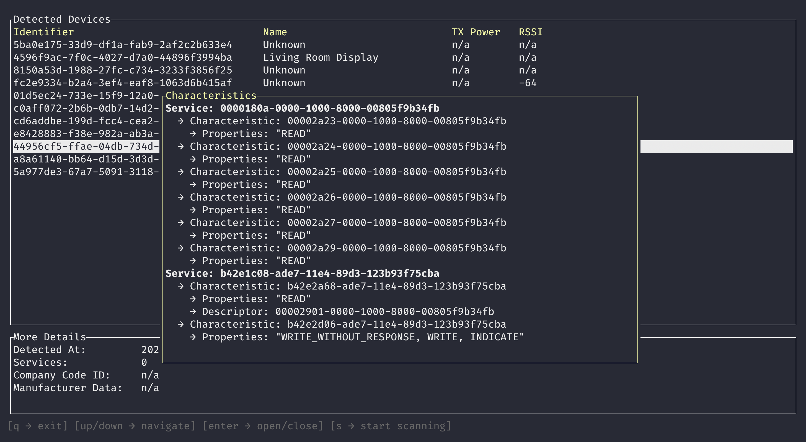

[](https://github.com/ztroop/btlescan/actions/workflows/build.yml)

# btlescan

A cross-platform terminal UI for scanning Bluetooth Low Energy devices, inspecting GATT services and characteristics, and reading/writing characteristic values in real time.



## Features

- **Device Discovery** — Continuous scanning with live updates of address/UUID, name, TX power, and RSSI.
- **GATT Inspection** — Connect to a device, discover services, and browse characteristics with their properties.
- **Read / Write** — Read characteristic values or write data in hex or text format.
- **Notifications** — Subscribe to characteristic notifications with a timestamped message log.
- **Server Mode** — Run a GATT server: set characteristic values for read responses, send notifications to subscribed clients.
- **CSV Export** — Export the device list to a CSV file.

## Keyboard Controls

### Client Mode

| Key | Action |
|-----|--------|
| `q` | Quit |
| `Tab` | Cycle focus between panels |
| `↑/↓` or `j/k` | Navigate lists / scroll log |
| `Enter` | Connect to selected device |
| `d` | Disconnect |
| `r` | Read selected characteristic |
| `w` / `i` | Write — enter editing mode |
| `n` | Toggle notification subscription |
| `t` | Toggle hex / text input format |
| `s` | Toggle scan pause/resume |
| `e` | Export devices to CSV |
| `m` | Switch to server mode |
| `Esc` | Cancel editing |

### Server Mode

| Key | Action |
|-----|--------|
| `a` | Start advertising |
| `x` | Stop advertising |
| `w` | Set characteristic value (returned on reads) |
| `n` | Send notification to subscribed clients |
| `t` | Toggle hex / text input format |
| `↑/↓` or `j/k` | Navigate fields / scroll log |
| `m` | Switch to client mode |
| `Esc` | Cancel editing |

## Installation

```sh
git clone git@github.com:ztroop/btlescan.git && cd ./btlescan
cargo install --path .
```

### Arch Linux (AUR)

```sh
paru -S btlescan
```

## Alternatives

If you're looking to manage or pair Bluetooth devices, check out [bluetui](https://github.com/pythops/bluetui)!
